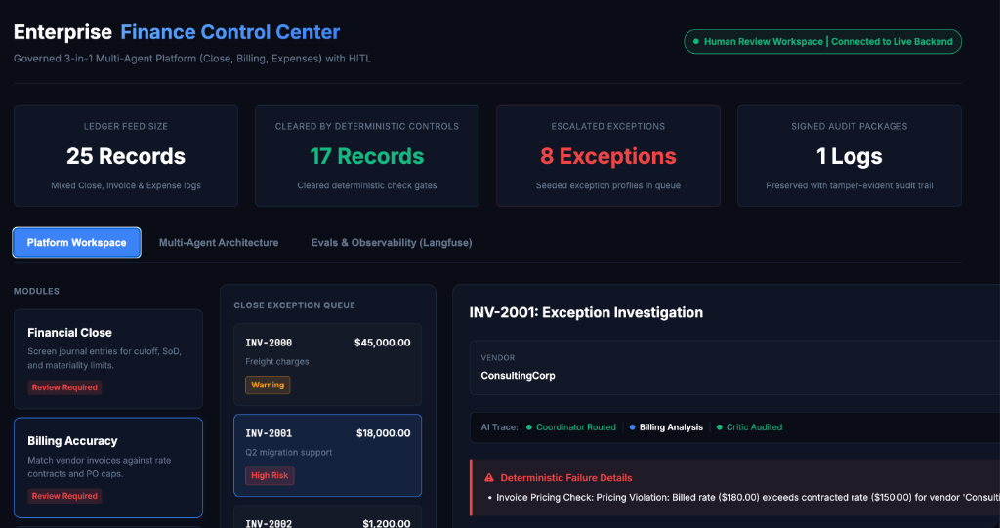
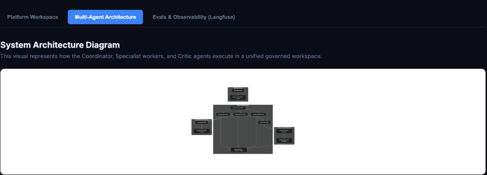
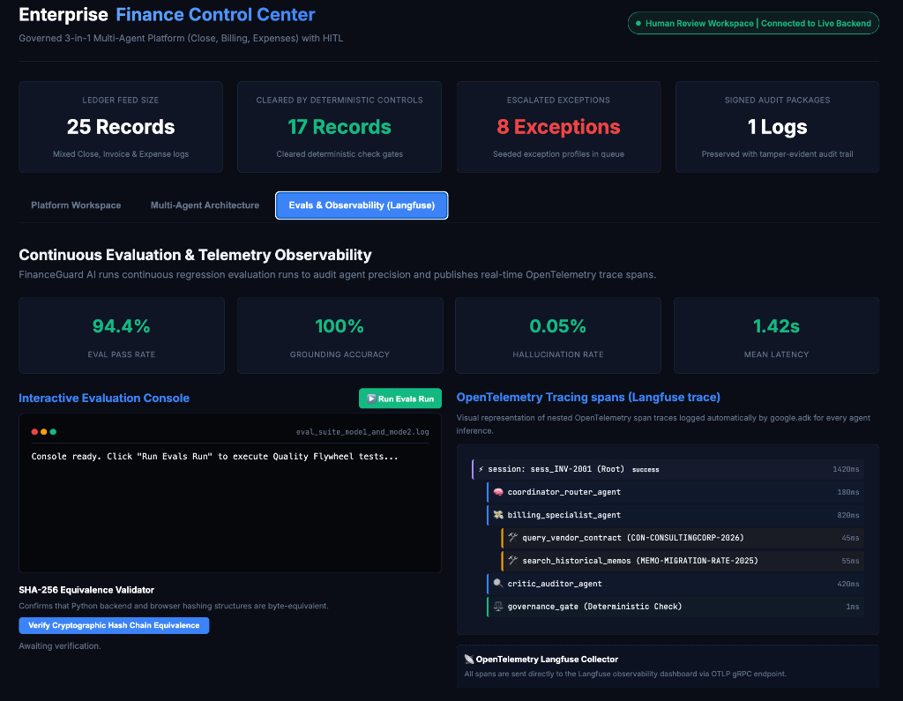
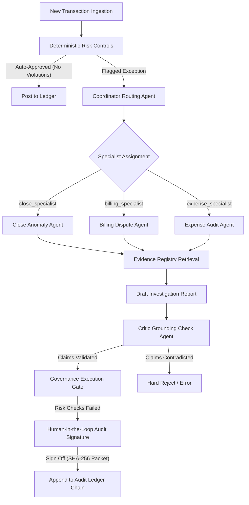

# FinanceGuard AI — Autonomous Multi-Agent Anomaly Control & Compliance Center

FinanceGuard AI is an enterprise-grade agentic financial control platform that governs general ledgers, corporate billing, and T&E expenses. It merges **deterministic corporate policies (risk gates)** with **probabilistic generative reasoning (Gemini 3.5 Flash agents)** and enforces human-in-the-loop reviews with tamper-evident cryptographic sign-offs.

Live Cloud Run Deployment: **[https://financeguard-ai-510163702922.us-east1.run.app](https://financeguard-ai-510163702922.us-east1.run.app)**

---

## 📸 Dashboard Preview

### 1. Platform Anomaly Workspace
Review real-time ledger anomalies, execute multi-agent investigations, and record Human-in-the-Loop overrides.


### 2. Multi-Agent System Architecture Flow
View the live orchestration route from deterministic controls through the agent network (Coordinator -> Specialist -> Critic -> Gate).


### 3. Evals & Langfuse Telemetry Console
Interactive latency, token budget, and precision metrics, alongside deep Langfuse transaction traces.


---

## 🧠 Governance System Architecture



1. **Deterministic Filter Gate:** Flags transactions with strict policy violations (Segregation of Duties, pricing limits, receipt caps).
2. **Coordinator Agent:** Dynamically inspects the anomaly payload and routes it to the designated Specialist worker.
3. **Specialist Worker Agent:** Retrieves targeted evidence from ERP records, vendor contracts, or expense receipts to draft a detailed findings report.
4. **Critic Grounding Agent:** Verifies every claim in the specialist report against raw documents, preventing hallucinations and validating citations.
5. **Governance Gate:** Enforces final policy matching and issues a verdict (Auto-Approve, Auto-Reject, or Human-in-the-Loop Escalation).
6. **SHA-256 Audit Ledger Chain:** Generates a tamper-evident audit packet signed by the reviewer and cryptographically chained to preceding actions.

---

## 🛠️ Project Structure

```
close-investigator/
├── app/
│   ├── agent.py               # Main agent architectures (Gemini 3.5 Flash)
│   ├── audit.py               # Cryptographic SHA-256 packager & signature chain
│   ├── fast_api_app.py        # FastAPI service backend
│   ├── mock_data.py           # Evidence registry, contracts, policies, profiles
│   ├── tools.py               # Deterministic controls & validation validators
│   └── index.html             # Premium glassmorphic workspace dashboard
├── tests/                     # Automated test suites
├── run_pilot.py               # Command-line investigation pipeline executor
├── evals.py                   # Latency, accuracy, and token-cost evaluation suites
├── pyproject.toml             # Dependency lock definition (Astral uv)
└── README.md                  # Landing documentation
```

---

## 🚀 Getting Started

### Prerequisites
* **Python package manager (uv):** [Install uv](https://docs.astral.sh/uv/getting-started/installation/)
* **Google Cloud SDK:** [Install gcloud SDK](https://cloud.google.com/sdk/docs/install)
* **Google ADK CLI:** `uv tool install google-agents-cli`

### Local Development
1. Clone the repository and install packages:
   ```bash
   uv sync
   ```
2. Set up local credentials:
   ```bash
   gcloud auth application-default login
   ```
3. Run the dashboard locally:
   ```bash
   uv run uvicorn app.fast_api_app:app --reload --port 8080
   ```
   Navigate to `http://localhost:8080` in your web browser.

---

## 📊 Run System Evaluations
Evaluate agent performance, verify accuracy, and estimate token-run costs:
```bash
uv run python evals.py
```

## ☁️ Cloud Run Deployment
Deploy the service live:
```bash
export GOOGLE_CLOUD_PROJECT="financeguard-ai-demo"
export GOOGLE_CLOUD_REGION="us-east1"
uvx google-agents-cli deploy --no-confirm-project --service-name financeguard-ai
```
